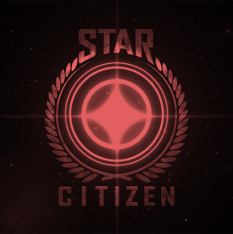

# Star Citizen Status to Streamdeck
Display an icon on your StreamDeck based on current Star Citizen status (https://status.robertsspaceindustries.com/index.xml).

Status is cached for 15 minutes. 


## Requirements
Server side
- PHP 8.0+
- `allow_fopen_url = 1`
- Read-write rights on a `cache` file located at the web root directory

For your Elgato Streamdeck
- Elgato Streamdeck or equivalent
- API Ninja plugin, by BarRaider (https://marketplace.elgato.com/product/api-ninja-fd59edeb-e7e5-412f-91ef-304c3e03f035)

## Installation

1. Copy all files to your webserver.
2. Install API Ninja plugin, if not already.
3. Create a new key with API Ninja and configure it as follows:
```
    Request Type                    GET
    API URL                         https://<your-domain.tld/path/to>/index.php
    Response Type                   Treat response as image for key
    Autorun every                   15 Minutes
    Hide green success indicator    yes
```

## Usage
If no icon is shown after installation, press the key to initialize. A red, green or white icon should appear.

### No open issues have been found


### At least an open issue has been found


### An error occurred and the status couldn't be updated

